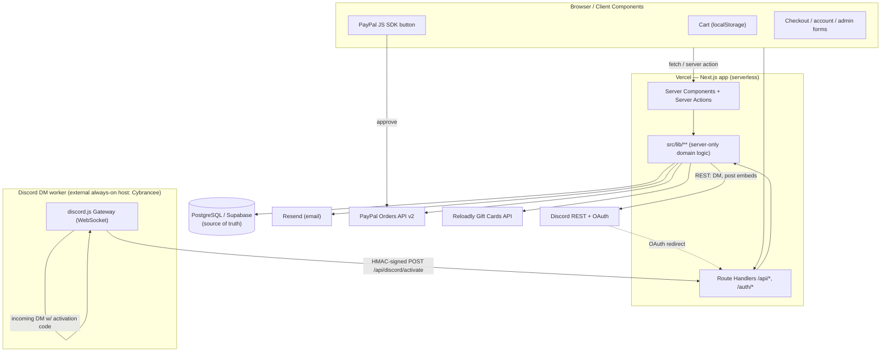
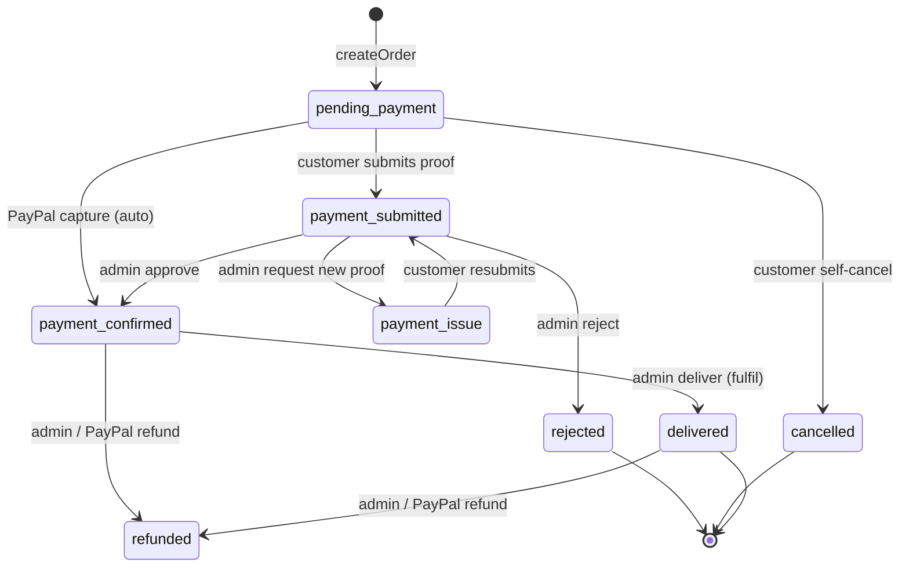
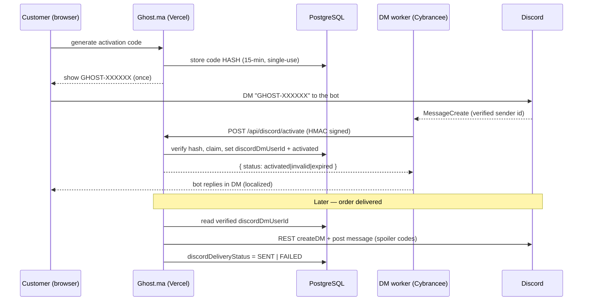

# Ghost.ma — Architecture

> Reference for engineers and AI coding agents joining the project. It describes
> **what is implemented today**, not the roadmap. Where something is prepared but
> not live, it is marked as such. Exact file paths, model names, and status
> strings are used so you can jump straight to the code.
>
> Repo root: `digitalshop/` (the product is branded **ghost.ma**).

---

## 1. System overview

Ghost.ma is a Moroccan digital-goods store (gift cards, licences, subscriptions).
A customer buys a product, pays (mostly by manual bank transfer with an uploaded
proof, or by PayPal), an admin confirms the payment and fulfils the order, and
the customer receives their code(s) on a secret delivery page, by email, and
optionally by Discord DM.

| Concern | Technology |
|---|---|
| Framework | **Next.js 15** (App Router), React 19 |
| Language | **TypeScript** (strict), server-first |
| Server logic | React **Server Components**, **Server Actions** (`"use server"`), a few **Route Handlers** (`src/app/api/**`) |
| ORM | **Prisma 6** (`@prisma/client`) |
| Database | **PostgreSQL** (referred to as **Supabase** in the codebase — `prisma/schema.prisma` header and `docs/production-env.md`) |
| Web hosting | **Vercel** (serverless) |
| Email | **Resend** (`resend` SDK) |
| Gift-card supplier | **Reloadly** Gift Cards API (sandbox by default) |
| Automated payments | **PayPal** Orders API v2 (sandbox by default) |
| Auth | Email/password (in-house scrypt sessions), **Google OAuth**, **Discord OAuth** — all hand-rolled, **no NextAuth** |
| Discord bot | `discord.js` — used **only** in a standalone worker + server-side REST helpers |
| File/proof storage | **PostgreSQL** (base64) — see §9. **There is no Vercel Blob / S3.** |

The dependency set is deliberately lean (see `package.json`): `next`, `react`,
`@prisma/client`/`prisma`, `resend`, `discord.js`, `dotenv`, `tsx`,
`server-only`. There is **no** `@vercel/blob`, `next-auth`, `@paypal/*`, or
`stripe` package — PayPal and OAuth are called over `fetch` directly.

### Responsibility map



- **Browser / client components** — cart state (localStorage only), form input,
  and the PayPal JS SDK button. Holds no secrets and is never trusted for
  authorization or amounts.
- **Next.js server (Vercel)** — all business logic, DB access, provider calls,
  session verification, and code disclosure decisions. Server Actions are the
  primary RPC surface; Route Handlers cover OAuth callbacks, uploads, the PayPal
  webhook, and the internal Discord activation endpoint.
- **PostgreSQL (Supabase)** — single source of truth for catalog, orders,
  payments, accounts, fulfilment, proofs, email logs, and settings.
- **Resend / PayPal / Reloadly / Discord** — external services, always reached
  server-side with server-only credentials.
- **Discord DM worker** — a separate always-on Node process (not on Vercel);
  see §2.

---

## 2. Deployment and runtime boundaries

There are **two independently deployed runtime components**.

### A. Main web application (Vercel)

- Next.js App Router app; deployed on Vercel serverless.
- **Server-side:** every Server Component, Server Action, and Route Handler;
  all Prisma/DB access; Resend, PayPal, Reloadly, and Discord REST calls; session
  decode/verify; code-disclosure authorization.
- **Client-side:** cart (localStorage), form UI, the PayPal button. No DB, no
  secrets.
- **Admin gating** and most order/account reads use live DB queries, so pages
  that touch them are effectively dynamic (`src/app/admin/layout.tsx` sets
  `export const dynamic = "force-dynamic"`).
- **Build/migrations:** `package.json` `build` runs
  `prisma generate && (prisma migrate deploy || echo …) && next build`. Migration
  deploy is **best-effort** — a failure is swallowed so the build still ships.
  Migrations need `DIRECT_URL` (a direct, non-pooled connection). There is **no**
  runtime DDL; `ensureDatabaseReady()` (`src/lib/db/prisma.ts`) only upserts
  catalog categories and the default `StoreSetting` row. See
  `docs/production-env.md` and `docs/payment-methods-migration-runbook.md`.

### B. Discord DM worker (external always-on host)

File: **`scripts/discord-dm-worker.ts`**. Scripts:
`npm run discord:dm-worker` (dev) / **`npm run start:worker`** (host) — both
`tsx scripts/discord-dm-worker.ts`.

- **Why it can't be serverless:** it holds a **persistent Discord Gateway
  WebSocket** to receive DMs. Vercel functions are short-lived and cannot keep a
  long-lived socket open, so this must be a small always-on process. Intended
  host: **Cybrancee** Node hosting (`docs/cybrancee-discord-worker.md`); the bot
  runs as `ghost.ma#9303`.
- **Responsibilities:** connect to the Gateway (`DirectMessages` +
  `MessageContent` intents, `Channel`/`Message` partials); when a customer DMs
  the bot a `GHOST-XXXXXX` activation code, POST it — with the **verified Discord
  sender id** from the DM event — to the web app's internal
  `/api/discord/activate`, then reply in the DM with the localized result.
- **HMAC boundary:** the worker signs `${timestamp}.${rawBody}` with
  HMAC-SHA256 using `DISCORD_DM_WORKER_SECRET` and sends
  `x-ghost-signature` + `x-ghost-timestamp`. The endpoint recomputes and
  `timingSafeEqual`s it, rejects >5 min skew, and **fails closed** if the secret
  is unset (503).
- **No DB access:** the worker never imports Prisma and never needs
  `DATABASE_URL` — the web app owns all persistence.
- **Isolation:** `discord.js` is imported **only** by the worker and the
  server-only `src/lib/discord/*` REST helpers, so it never enters the browser
  bundle.
- **Note:** the *outbound* Discord order-delivery DM (§8C) is sent by the **web
  app** via Discord REST (`src/lib/discord/dm.ts`), not by this worker. The
  worker's sole job is inbound activation.

---

## 3. Database architecture

Prisma schema: `prisma/schema.prisma`. Migrations: `prisma/migrations/**`.
Status/enumeration fields are **strings** (with the allowed set documented in
comments and enforced by TypeScript unions in `src/lib/types.ts`), not native
Postgres enums.

### Identity & auth
- **`Customer`** — the account. Holds identity (`name`, `email` unique,
  `firstName`/`lastName`, `phone`, `image`), `role` (`CUSTOMER` | `ADMIN`),
  and every login credential: `passwordHash` (scrypt), `googleId` (unique),
  and the Discord OAuth identity. Also owns the Discord DM state and the global
  Discord delivery preference. **Source of truth for who can log in.**
- **`AuthToken`** — hash-only, single-use, expiring tokens for
  `email_verification` and `password_reset`. Only `tokenHash` is stored.
- **`DiscordActivationCode`** — hash-only, single-use, 15-min DM activation
  codes (mirrors `AuthToken`). Generating a new one invalidates prior unused
  codes.

### Catalog
- **`Product`** → **`ProductVariant`** (the actual purchasable SKU, with
  `priceMad`, `faceValue`/`faceCurrency`, and `stockControl`
  `manual` | `api` | `reloadly`). **`Category`**, **`ProductMedia`** support it.
- **`DigitalCode`** — local code inventory: `status`
  `unused` | `reserved` | `used` | `disabled`, atomically claimed at delivery.
  Unique `(productId, code)`.

### Orders & fulfilment
- **`Order`** — the central record. `status` string (see §5), `customerId`
  (nullable — `SetNull`, so deleting a customer preserves the order as a guest
  row), snapshot `customerName`/`customerEmail`, `paymentMethod`, `totalMad`.
  Key extra fields:
  - `orderNumber` — a live autoincrement column that the app **does not read**;
    public order numbers are computed from creation-order sequence in
    `src/lib/orderNumber.ts`. Kept only so schema matches the DB.
  - `deliveryToken` (unique) — unguessable secret embedded in the delivery
    email link; **the** authorizer for code disclosure to guests (see §13).
  - PayPal reconciliation snapshot: `paymentProvider`,
    `paymentProviderOrderId`/`CaptureId` (unique), `paymentProviderStatus`/
    `RawStatus`, `paymentProviderAmount`/`Currency`, `paymentConfirmedAt`.
  - Discord dashboard refs: `discordMessageId`, `discordThreadId`.
  - Discord DM delivery: `discordDeliveryRequested`,
    `discordDeliveryPreferenceSet`, `discordDeliveryStatus`
    (`NOT_REQUESTED` | `PENDING` | `SENT` | `FAILED`),
    `discordDeliveryAttemptedAt`/`SentAt`, `discordDeliveryError` (safe category
    only, never a code). See §8C for the follow-global-vs-explicit invariant.
- **`OrderItem`** — line items, `SetNull` on variant delete.
- **`DeliveredCode`** — the fulfilled codes for an order. `source`
  `local` | `reloadly` (audit metadata). Code text lives in `digitalCode.code`
  (local) or `manualCode` (manual/Reloadly). **`deliveryPayload`** (JSON) holds
  normalized multi-field deliveries — an array of
  `{ code?, pin?, url?, instructions? }` — for suppliers richer than a single
  code. Unique on `digitalCodeId` so a local code can't be delivered twice.

### Payments
- **`PaymentProof`** — customer-uploaded proof, stored as **base64 in Postgres**
  (`data`), unique per order. PNG/JPG/JPEG/PDF.
- **`PaymentEvent`** — append-only audit trail (`status_change`,
  `proof_uploaded`, `admin_note`, `discord_delivery`, …).
- **`PaymentWebhookEvent`** — idempotency ledger for verified PayPal webhooks;
  stores identifiers only, never the raw payload.
- **`PaymentMethod`** — one reorderable row per customer-facing method: `type`
  `bank` | `paypal` | `crypto` | `card` | `cash` | `custom`, with per-type
  `details` JSON (rib, walletAddress, paypalEmail, …), `visible`, `status`,
  `sortOrder`, `proofRequired`, `regions`, `archivedAt`. **Replaced** the old
  fixed `Bank` / `CryptoWallet` / `PaymentMethodConfig` tables (dropped in
  migration `20260706120000_drop_legacy_payment_tables`).

### Support & settings
- **`SupportConfig`** — WhatsApp/email/instructions.
- **`StoreSetting`** — a keyed JSON blob (`id = "default"`) holding the entire
  editable store config (branding, homepage toggles, inventory switch, email
  templates, legal pages, payment display, footer, theme). Shape and defaults in
  `src/lib/storeSettings.ts`.
- **`EmailLog`** — every transactional email (rendered subject/text/html,
  provider status, `templateKey`, metadata). See §10.

### Inventory
Local stock is just `DigitalCode` rows with `status="unused"`. There is a
**global inventory toggle** (`StoreSettings.inventoryEnabled`) plus an
`inventoryMode` (`automatic` | `manual`). When disabled, quantity never blocks a
purchase (`isInventoryEnabled` / `isStockTracked` in `src/lib/storeSettings.ts`).

---

## 4. Authentication & account architecture

All auth is **in-house** (no NextAuth). Core: `src/lib/auth.ts`.

**Session:** a stateless signed cookie `ghost_customer_session` =
`base64url({customerId, exp}) + "." + HMAC-SHA256`. Secret from `AUTH_SECRET`
(or `NEXTAUTH_SECRET`/`SESSION_SECRET`); **throws in production if unset**.
Passwords hashed with **scrypt** (`scrypt:salt:key`, `timingSafeEqual` verify).
A session is only valid while the account still has *some* credential
(password, Google, or Discord).

### Four separate concepts — do not conflate

1. **Authentication provider connection** — how the customer logs in:
   email/password, Google (`googleId`), or Discord (`discordId`). Multiple can
   coexist (`authProvider` records combos like `password_discord`).
2. **Discord OAuth identity** — `discordId` + username/global name/avatar.
   Proves "this account owns this Discord login." Does **not** imply the bot can
   DM the user.
3. **Discord DM activation** — `discordDmUserId` (+ dm username/display/avatar,
   `discordDmActivated`). Set **only** by the DM worker after the customer sends
   a valid activation code. This — not the OAuth id — is the source of truth for
   DM delivery.
4. **Discord order-delivery preference** — whether fulfilled codes are also
   DM'd. A global default (`discordOrderDeliveryEnabled`) plus an order-level
   snapshot (§8C).

### Login methods
- **Email/password:** register → verification email (`AuthToken`) → login.
  `validatePassword` requires ≥8 chars with a letter and a digit.
- **Google OAuth:** `src/app/auth/google/*`. Google returns a verified email, so
  Google login **may match an existing account by email** and link `googleId`.
- **Discord OAuth:** `src/app/auth/discord/*`. Discord's `identify` scope returns
  **no email**, so Ghost.ma **never** matches/merges on a provider email for
  Discord. A brand-new Discord account gets a stable, non-deliverable
  **placeholder email** `discord-<id>@users.noreply.ghost.ma`
  (`buildPlaceholderEmail`). Placeholder addresses are never shown, never receive
  mail (§10), and never count as verified or as a usable password login.

### Incomplete Discord account completion
A new Discord account is redirected to `/auth/discord/complete`
(`src/app/auth/discord/complete/*`). Two paths (`src/app/actions/discord.ts`):
- **Path A — complete profile:** replace the placeholder email with a real
  name/email/phone; sends verification. A colliding email is **refused** (never
  merged) with a prompt to use the link path.
- **Path B — link existing:** authenticate an existing account by
  password (`linkDiscordToExistingByPasswordAction`) or by Google
  (`mode=link_discord` in the Google callback), then **transfer** the Discord
  identity onto it.

### Account merge / consolidation (`transferDiscordIdentity`)
Moves a Discord identity from an incomplete Discord-only **source** onto an
existing **target**, transactionally:
- Transfers the source's **orders** and **email logs** to the target.
- Deletes the source **first** (freeing its unique `discordId`), then copies the
  Discord OAuth **and** DM-activation fields onto the target; OR's the delivery
  preference; sets `authProvider` accordingly.
- **Merge invariant — the preserved primary (target) keeps its own:** name,
  primary email, verification state, credentials (password/Google), and existing
  providers. **The secondary (source) contributes:** orders, Discord OAuth
  identity, Discord DM activation state, and delivery preference. The secondary
  account and its placeholder email are then **deleted**.
- Requires proven control of **both** accounts and email confirmation on the
  target side (the target is authenticated by password/Google before transfer).

### Provider linking & lockout protection
- Linking a provider already owned by another account is **refused**
  (`discord_already_linked` / `google_already_linked`) — one provider identity
  never belongs to two active accounts.
- **Unlink protection:** `loginMethodCount` / `canDisconnectProvider` /
  `canDisconnectDiscord` ensure at least one usable login method remains. A
  password only counts when the email is non-placeholder. Disconnecting Discord
  also clears all DM state and invalidates pending activation codes.

---

## 5. Order lifecycle

`Order.status` is a string. Canonical statuses (schema comment +
`src/lib/orderStatus.ts` + `src/lib/db/*`):

| Status | Meaning |
|---|---|
| `pending_payment` | Created, awaiting payment (also legacy `pending`/`awaiting_payment`) |
| `payment_submitted` | Customer uploaded a proof; awaiting admin review |
| `payment_confirmed` | Admin (or PayPal capture) confirmed payment; ready to fulfil |
| `payment_issue` | Admin flagged a problem / requested a new proof |
| `rejected` | Admin rejected the payment |
| `delivered` | Code(s) delivered — terminal happy path |
| `refunded` | Refunded |
| `cancelled` | Cancelled |



**Who triggers what**
- **Customer:** create order (`createOrderAction`); submit proof / change method
  / self-cancel (`src/app/actions/payments.ts`); pay via PayPal
  (`src/app/actions/paypal.ts`). **Self-cancel is allowed only in the pre-payment
  states** (`canCustomerCancel` → `PENDING_PAYMENT_STATUSES`); once a proof is in
  or payment is captured, the customer must contact support.
- **Admin:** approve/reject/flag payment; deliver (fulfil); refund
  (`src/lib/db/payments.ts`, `src/lib/db/fulfillment.ts`).
- **PayPal:** an approved capture (browser or webhook) can move
  `pending_payment → payment_confirmed` automatically (§6).

**Trigger points**
- **Fulfilment:** `deliverOrder()` (`src/lib/db/fulfillment.ts`) — allowed only
  from `payment_confirmed`; writes `DeliveredCode`s, sets `status="delivered"` +
  a fresh `deliveryToken`, all in one transaction.
- **Email:** `order_received` on create, `payment_confirmed` on approve,
  `order_delivered` on deliver, plus review emails (rejected / new-proof /
  refund) — see §10.
- **Discord DM:** fired after successful delivery (`deliverOrderViaDiscord`),
  non-blocking (§8C).
- **Refreshless UX:** Server Actions + `revalidatePath` update account/payment
  pages; the payment page also `router.refresh()`es after a manual Discord send.
  There is no websocket/polling status feed to the customer beyond that.

---

## 6. Payment architecture

Methods are data rows (`PaymentMethod`), not hardcoded. Helpers:
`src/lib/paymentMethod.ts`. Customer flow: `src/app/actions/payments.ts` +
`src/lib/db/payments.ts`.

| Method | Status today |
|---|---|
| **Bank transfer** | **Functional** — the primary manual flow (upload proof, admin confirms) |
| **PayPal** | **Functional but sandbox by default** (`PAYPAL_ENV` defaults to `sandbox`); live only when fully configured (§14). Card funding rides the same PayPal backend |
| **Crypto (USDT)** | **Configured / manual** — a `crypto` method with a wallet address + manual proof; no on-chain verification |
| **Card** | **Coming soon** — `card` type; when `details.comingSoon` it is filtered out of checkout and PayPal refuses it |
| **Cash / custom** | Supported as manual method types |

**Checkout & method selection**
- Payment method is chosen on the **payment page** (`/payment/[id]`), not
  required at checkout (`createOrder` stores `paymentMethod: ""` until picked).
- All **bank accounts collapse to one "Virement bancaire"** entry at checkout
  (`buildCheckoutMethods` / `bankTransferCheckoutMethod`, id `BANK_TRANSFER`);
  the customer picks the specific bank later on the payment page.
  `announcedPaymentMethods` drives the pre-payment/cart preview (drops
  coming-soon cards).
- Changing method before paying: `changePaymentMethodAction` (pending orders
  only).

**Bank / manual proof flow**
- `submitPaymentAction` accepts a proof file (PNG/JPG/JPEG/PDF, **≤5 MB**,
  extension-sniffed if MIME is missing), stores it base64 in `PaymentProof`, and
  moves the order to `payment_submitted`.
- Admin reviews in the order detail; approve → `payment_confirmed`, reject →
  `rejected`, request new proof → `payment_issue`, each with a live-previewed
  customer email.

**PayPal (Orders API v2)** — `src/lib/paypal/*`, `src/app/actions/paypal.ts`,
webhook `src/app/api/webhooks/paypal/route.ts`:
- Client renders the PayPal button with `NEXT_PUBLIC_PAYPAL_CLIENT_ID` only.
- Server creates the PayPal order (idempotently reusing an open one), captures
  it, and **always re-fetches trusted state from PayPal** before changing the
  Ghost order — never trusts the client or an unverified webhook body. The
  captured amount/currency is compared against the snapshot locked in at order
  creation (`amountsRoughlyEqual`).
- Webhooks are signature-verified and deduped via `PaymentWebhookEvent`.
- Fails closed to sandbox; refuses `card` methods still marked coming-soon.

**Card-data & saved methods**
- Ghost.ma **never stores raw card data.** Card payment, when enabled, is guest
  checkout through PayPal's own card processing.
- **Saved payment methods (vault/tokenization) are NOT implemented** and are not
  part of the current architecture.
- *Future consideration:* any future saved-card/PayPal-vault feature must use
  provider-side tokenization/vaulting; Ghost.ma must never store PANs.

---

## 7. Reloadly architecture

Code: `src/lib/reloadly/{config,client,operations}.ts`; wired into fulfilment in
`src/lib/db/fulfillment.ts`. Smoke test: `npm run reloadly:smoke-test`.

- **Mode:** `RELOADLY_ENV` — **fails closed to `sandbox`** unless explicitly
  `live` (`getReloadlyEnvironment`), so a misconfig can never place a real-money
  order. Sandbox and live are separate credential pairs.
- **Auth:** OAuth2 **client-credentials**; tokens cached per audience/base URL
  with an early-refresh skew. The client is the **only** module that reads
  credentials or builds the `Authorization` header, and it never logs secrets or
  tokens. Gift Cards API needs the versioned `Accept` header.
- **Product mapping:** a `ProductVariant` opts in with `stockControl="reloadly"`
  + `reloadlyProductId` + `reloadlyCountryCode`; `faceValue`/`faceCurrency` map
  to a Reloadly denomination.
- **Fulfilment path (`deliverOrder`):** Reloadly-sourced entries are resolved
  **before** the DB transaction (external HTTP + real wallet spend must not
  happen inside an open Postgres transaction). Per entry:
  1. **Pre-flight denomination validation** (`validateReloadlyDenomination`) —
     confirms currency/country/denomination *before* spending, turning
     Reloadly's opaque "invalid price" into a clear French message.
  2. `placeGiftCardOrder` → poll status (`/reports/transactions/{id}`) up to 3×
     if not immediately `SUCCESSFUL` → fetch cards
     (`/orders/transactions/{id}/cards`).
  3. **Normalization** (`normalizeReloadlyCards`): each card becomes a
     `{ code | url, pin? }` field **by meaning** — a URL-shaped `cardNumber`
     becomes a redemption `url`, otherwise a `code`; `pinCode` is a separate
     `pin`. Never a concatenated junk string.
  - On any failure the whole delivery **aborts with zero DB writes**.
- **Fulfilment data classification** (stored on `DeliveredCode`): `source`,
  `reloadlyTransactionId`, and the structured **`deliveryPayload`** array of
  `{ code?, pin?, url?, instructions? }`. `manualCode` keeps a compact
  admin-only representation. **Arbitrary Reloadly response fields are never
  rendered to customers** — only the normalized fields are.
- **Manual fallback:** admins can always deliver by pasting a local/manual code
  instead of using Reloadly.
- **Admin visibility:** wallet balance and product browsing via the Suppliers
  panel (read-only; spends nothing).
- **Caveat:** per-entry purchases are sequential with **no persisted idempotency
  ledger** — safe for single-Reloadly-item orders; re-clicking "Livrer" on a
  multi-Reloadly-item order after a mid-way failure can re-purchase earlier
  items. See §15.
- **Stale comment:** the header of `operations.ts` still says it is "not wired
  into the production order flow" — that is **out of date**; `deliverOrder`
  calls it (§ inconsistencies below).

---

## 7b. Pricing subsystem (Phase 1)

Full detail: **`docs/pricing-architecture.md`**. Separates **provider cost** from
**suggested price** from **published customer price**, so a Reloadly sync can
never touch a live price.

- **Cost layer:** `syncReloadlyProviderCosts()` (`src/lib/db/pricing.ts`; CLI
  `npm run reloadly:cost-sync`) fetches mapped Reloadly products, computes cost
  via the single formula in `src/lib/pricing/cost.ts` (Decimal, never float:
  `senderBase + senderFee + senderBase·feePct/100 − senderBase·discountPct/100`),
  and upserts `ReloadlyProviderCost` — **never `priceMad`**. Every row is
  `environment`-stamped (sandbox/live never mix). RANGE products price only
  mapped face values; FIXED price the offered denominations.
- **Suggestion engine:** `src/lib/pricing/suggested-price.ts` —
  cost → internal FX (`fxRatesToMad`) → margin ladder (variant fixed price →
  variant → product → category → global default) → rounding (1/5/10, nearest/up)
  → suggested MAD. Pure and unit-tested (`test/pricing/*`, `npm test`).
- **Settings:** admin-controlled, keyed `StoreSetting` row `id="pricing"`
  (`src/lib/db/pricing-settings.ts`). No automatic FX feed in this phase.
- **Admin:** **Catalogue → Tarification** (`src/components/admin/PricingPanel.tsx`,
  actions in `src/app/actions/pricing.ts`). Shows cost/suggested/published/drift;
  publishing is an **explicit** action (`publishSuggestedPrice` — the only writer
  of `priceMad`). No auto-publish.
- **Reconciliation:** after a real Reloadly order, `deliverOrder` records
  estimated-vs-actual cost (`ReloadlyCostReconciliation`) — append-only audit,
  never customer-visible, never feeds back into a price.
- **Schema:** `Product/Category/ProductVariant` margin overrides +
  `ProductVariant.fixedSuggestedPriceMad`; new models `ReloadlyProviderCost`,
  `PricingSyncRun`, `ReloadlyCostReconciliation`. Migration
  `20260709160000_add_pricing_subsystem`.

### Catalog importer (Phase 2)

Admin tool to turn Reloadly products into Ghost catalog products/variants.

- **Route:** `/admin/catalog/import-reloadly` (`src/app/admin/catalog/import-reloadly/page.tsx`),
  nav item **Catalogue → Importer Reloadly**. Standalone page inside the admin
  shell (`AdminShellRoute`; standalone-route ids in `AdminShell.ADMIN_STANDALONE_ROUTES`).
- **Server layer:** `src/lib/db/catalog-import.ts` — `searchReloadlyImportCatalog`
  (name/country/type/status filters; multi-page scan for name search),
  `getReloadlyImportDetail` (product + per-denomination cost/suggested-price
  preview via the Phase 1 engine), `previewReloadlyDenominations` (RANGE custom
  + bounds validation), `importReloadlyProduct` (create/update parent + variants).
  Actions: `src/app/actions/catalog-import.ts`. UI: `src/components/admin/ReloadlyImporter.tsx`.
- **FIXED** products expose all offered denominations; **RANGE** products let the
  admin add only chosen denominations, validated against Reloadly min/max.
- **Dedup:** existing slug is reused (variants appended); an existing
  `(product, faceValue, faceCurrency)` variant is skipped ("Déjà ajouté").
  Region is mapped from the Reloadly country (`reloadlyCountryToRegion` in
  `src/lib/regions.ts`), unknown → "" for the admin to complete.
- Import upserts the matching `ReloadlyProviderCost` rows so the pricing panel
  reflects new variants immediately. Published price defaults to the suggested
  price but is **admin-editable before import**; nothing auto-publishes beyond
  that. Places **no** Reloadly order. Manual/local products (e.g. Valorant) are
  untouched and still created from the normal product editor.
- **Not yet:** auto-pricing/auto-publish; storefront still reads only
  `ProductVariant.priceMad`.

---

## 8. Discord architecture

Three **separate** systems. Env/enablement centralized in
`src/lib/discord/config.ts`; `isDiscordEnabled()` requires
`DISCORD_INTEGRATION_ENABLED=true` **and** a bot token **and** a guild id.

### A. Discord OAuth (login / linking / merge)
`src/app/auth/discord/*`. Login/register by Discord id (never email); new
accounts get a placeholder email and go to the completion flow; link mode
attaches Discord to the current account; already-owned identities are refused.
Merge/transfer covered in §4.

### B. Discord DM activation
`src/lib/discord/activation.ts`, endpoint `src/app/api/discord/activate/route.ts`,
worker `scripts/discord-dm-worker.ts`, UI actions in `src/app/actions/discord.ts`.

- Customer generates a code in-app (`generateActivationCodeAction`) — format
  `GHOST-XXXXXX` (unambiguous alphabet), **15-min TTL**, **hash-only** storage,
  **single-use**, and generating a new one invalidates prior unused codes.
- Customer DMs the code to the bot → worker POSTs it with the **verified sender
  id** to `/api/discord/activate` (HMAC-authenticated, §2).
- `verifyAndActivate` atomically claims the code and records the **verified
  Discord DM identity** on the customer (`discordDmUserId`, …,
  `discordDmActivated=true`). The endpoint returns only a coarse status and never
  echoes the code.



### C. Discord order delivery
`src/lib/discord/dm.ts`, triggered from `deliverOrder`
(`deliverOrderViaDiscord`) and from customer actions in
`src/app/actions/discord.ts`.

- **Account-level default:** `Customer.discordOrderDeliveryEnabled`.
- **Order-level snapshot:** `discordDeliveryRequested` +
  `discordDeliveryPreferenceSet`. **Invariant:** until the customer explicitly
  toggles the per-order checkbox (`preferenceSet=true`), the order **follows the
  live global default**, resolved at read/send time — so enabling the global
  default later also applies to still-pending orders. A mere page view never
  persists a choice.
- **Automatic send** after fulfilment (`trigger:"auto"`) only when the effective
  request is on and status isn't already `SENT`.
- **Manual "Envoyer aussi sur Discord"** (`sendOrderToDiscordAction`,
  `trigger:"manual"`) for an already-delivered order — throttled (30 s min
  interval + in-flight guard), destination is **always** the stored verified DM
  id, never client input; permits a resend.
- **Status:** `discordDeliveryStatus` `NOT_REQUESTED` | `PENDING` | `SENT` |
  `FAILED`; failures store only a coarse category (`discordDeliveryError`),
  never a code/payload.
- **Non-fatal by design:** `sendDeliveredOrderDm` **never throws** and never
  changes whether the order is considered delivered. Discord DM is an
  **additive** channel — the customer always gets the codes through the primary
  delivery page + email regardless of Discord.
- **Secret handling:** sensitive values are wrapped in Discord **spoiler**
  syntax (`||\`code\`||`); a plain public redemption URL is sent unblurred, but a
  URL carrying a sensitive token is spoilered (`urlHasSensitiveToken`). Codes
  never go into embeds, logs, error messages, or audit notes.

### Other Discord surfaces (admin ops)
`src/lib/discord/notify.ts` + `channels.ts` post **admin-only** ops
notifications (orders feed with a per-order card+thread, accounts, support,
stock/system alerts) to private channels via REST. Channel ids come from env
vars; **never-throw** contract. This is separate from customer DM delivery.

---

## 9. Storage architecture

**PostgreSQL (Supabase)** — all relational application data: catalog, products
& variants, orders/items, delivered codes & fulfilment payloads, customers &
auth, payment methods/events/webhook ledger, email logs, and settings.

**Payment proofs & uploaded images live in Postgres, not object storage:**
- `PaymentProof.data` — customer proof as **base64** in Postgres (PNG/JPG/JPEG/
  PDF, ≤5 MB). Served to admins via `getPaymentProofAction`.
- Admin image upload (`src/app/api/upload/route.ts`, admin-gated): in
  **production** returns a **`data:` URI** (embedded base64, effectively stored
  in the DB row that references it); in **development** writes to
  `public/uploads/`. Allowed: PNG/JPG/WebP, ≤5 MB.

**There is no Vercel Blob, S3, or external object store.** The `PaymentProof`
comment ("until object storage is configured") flags this as an intended future
migration, but today Postgres is the store. `localStorage` (browser) holds only
the pre-checkout cart.

---

## 10. Email architecture

Provider: **Resend** (`src/lib/email/send-email.ts`). Templates:
`src/lib/emailTemplates.ts` + editable bodies/subjects in
`StoreSettings.emailTemplates`.

- **Rendering:** `renderTransactionalEmail` merges the store's template
  (subject + body, admin-editable) into a branded HTML shell and a plain-text
  version from the **same source**, so the admin preview equals what the customer
  receives. Auth emails must render the branded shell or the send throws.
- **Sending:** real send only in production or when `ENABLE_REAL_EMAILS=true`;
  otherwise `status="simulated"`. Every attempt is written to **`EmailLog`**
  (rendered subject/text/html, provider status, `templateKey`, metadata) — the
  audit + admin review source of truth. `replyTo` from `SUPPORT_EMAIL`/footer.
- **Key events:** `order_received`, `payment_confirmed`, `order_delivered`
  (secret token link, **never the raw codes** — the body's `{{codes}}` var is not
  populated on the delivery path), plus admin review emails `payment_rejected`,
  `new_proof_requested`, `refund_update`. Account: `email_verification`,
  `welcome`, `password_reset`, `password_changed`.
- **Placeholder guard:** internal `@users.noreply.ghost.ma` recipients are
  **never** emailed — a skipped `EmailLog` is recorded and callers proceed
  unaffected.
- **Secret hygiene:** fulfilment secrets are never logged; delivery emails link
  to the token page rather than embedding codes.
- **Failure visibility:** send failures fire an admin Discord `notifyEmailFailure`.

---

## 11. Admin architecture

Admin UI under `src/app/admin/**` (panels in `src/components/admin/**`); actions
in `src/app/actions/admin.ts` and `src/lib/db/**`.

- **Gating:** `src/app/admin/layout.tsx` calls `requireAdminCustomer()`
  (redirects non-admins to `/403`, unauthenticated to `/login?next=/admin`).
  `role="ADMIN"` on `Customer`; promote via `prisma/promote-admin.ts`. Upload and
  admin server actions re-check admin server-side.
- **Orders:** list/detail, payment review (approve/reject/request-proof with
  live email preview), fulfilment (local codes, manual codes, and Reloadly),
  Discord delivery visibility (connection state + delivery status/error),
  proof viewer, email-log timeline. Order refs shown as `#<sequence>` (public
  number) and internal id.
- **Products/catalog:** products, variants, categories, featured, media.
- **Payments config:** `PaymentMethod` CRUD/reorder/archive with per-type
  editors and preview.
- **Suppliers:** Reloadly wallet balance + catalog browse (read-only). *Note:*
  this panel is intentionally in **English** (rest of app is French).
- **Inventory:** stock view + the global inventory enable/disable toggle.
- **Support/contact, email templates, legal pages, maintenance mode,
  home/footer config** — all edit `StoreSetting`/`SupportConfig`.
- **Overview dashboard:** trailing-7-day revenue/orders with deltas, review
  queue, stats.

---

## 12. Customer experience architecture

Browse catalog (`/products`, `/`) → product/variant selection
(`/products/[id]`) → cart (`/cart`, localStorage; `StoreContext`) → checkout
(`/checkout`, region-compatibility confirmation via `RegionPanel`/`RegionBadge`)
→ order creation (guest or logged-in; logged-in identity overrides typed
name/email) → **payment hub** (`/payment/[id]`: pick method, see bank RIBs /
PayPal button / crypto address, upload proof or pay) → payment confirmation
(admin or PayPal) → fulfilment → **order tracking** (`/order/[id]`,
`/find-order`) → **code reveal** on the secret **delivery page**
(`/delivery/[token]`) → optional Discord DM → account order history
(`/account/orders`). Guests can find an order by public number + email
(`findOrderAction`).

---

## 13. Security boundaries & invariants

- **No raw card data** is ever stored; card payments ride PayPal.
- **Provider secrets stay server-side** — Reloadly/PayPal/Google/Discord
  secrets, `AUTH_SECRET`, and the Discord bot token are never exposed to the
  client. Only `NEXT_PUBLIC_PAYPAL_CLIENT_ID` / Discord *client* id are public
  (identifiers, not authority).
- **Discord bot token** is worker/server-only; `discord.js` never ships to the
  browser.
- **Worker↔app calls use HMAC-SHA256** over `${timestamp}.${body}` with a
  ≤5-min skew window; the endpoint **fails closed** without the secret.
- **Discord activation codes** are hash-only, 15-min, single-use, and superseded
  on regeneration.
- **Order ownership is verified server-side.** The **public order number is
  enumerable** and is *not* an authorizer: delivered codes are disclosed only to
  (a) a holder of the unguessable `deliveryToken`, or (b) the logged-in order
  owner (`getCustomerOrder` / `buildCustomerDTO` in `src/lib/db/orders.ts`).
- **Discord destination is always the server-stored, worker-verified
  `discordDmUserId`** — never a value from the client.
- **Fulfilment secrets are never logged**; DM/email carry them only via
  spoilered fields or token links.
- **Account merges** require explicit confirmation, proven control of both
  accounts, and run in a single transaction.
- **Provider linking** refuses an identity already owned by another account;
  **unlinking** refuses to leave zero login methods.
- **Proof uploads** enforce type (PNG/JPG/JPEG/PDF) and size (≤5 MB).

---

## 14. Environment variable map

Values are never committed. Grouped by runtime; exact names from the code.

### Main web app (Vercel)
| Variable | Purpose | Notes |
|---|---|---|
| `DATABASE_URL` | Postgres (Supabase) connection | **Required** (pooled) |
| `DIRECT_URL` | Direct connection for `prisma migrate deploy` | Recommended; migrations skip if unset |
| `AUTH_SECRET` (or `NEXTAUTH_SECRET` / `SESSION_SECRET`) | Session cookie HMAC | **Required in production** (throws otherwise) |
| `NEXT_PUBLIC_SITE_URL` / `SITE_URL` / `APP_URL` | Absolute URLs in emails/OAuth redirects | Optional (falls back to request host) |
| `GOOGLE_CLIENT_ID`, `GOOGLE_CLIENT_SECRET` | Google OAuth | Optional (gates Google login) |
| `DISCORD_CLIENT_ID`, `DISCORD_CLIENT_SECRET` | Discord OAuth | Optional (gates Discord login); secret server-only |
| `DISCORD_APPLICATION_ID` / `NEXT_PUBLIC_DISCORD_APPLICATION_ID` | "Open Discord" deep link | Optional (falls back to client id) |
| `DISCORD_INTEGRATION_ENABLED` | Master Discord switch (`"true"`) | Required for any Discord bot/DM/ops feature |
| `DISCORD_BOT_TOKEN` | Bot token (REST: DMs, ops posts) | Required for Discord features; server-only |
| `DISCORD_GUILD_ID` | Guild the bot acts in | Required for `isDiscordEnabled` |
| `DISCORD_OWNER_USER_ID` | Owner id (setup/permissions) | Optional |
| `DISCORD_CHANNEL_*_ID` (ORDERS_FEED, ACCOUNTS, SUPPORT, STOCK_ALERTS, SYSTEM_ALERTS, DAILY_SUMMARY), `DISCORD_ROLE_BUSINESS_MANAGER_ID` | Admin ops channels/role | Optional per channel |
| `DISCORD_DM_WORKER_SECRET` | Shared HMAC secret for `/api/discord/activate` | Required for DM activation; **must match the worker** |
| `RELOADLY_CLIENT_ID`, `RELOADLY_CLIENT_SECRET` | Reloadly OAuth2 | Optional (gates supplier fulfilment) |
| `RELOADLY_ENV` | `sandbox` \| `live` | Optional; **defaults to sandbox** |
| `PAYPAL_CLIENT_ID`, `PAYPAL_CLIENT_SECRET`, `PAYPAL_WEBHOOK_ID` | PayPal server creds | Optional (all three gate live PayPal) |
| `PAYPAL_ENV` | `sandbox` \| `live` | Optional; **defaults to sandbox** |
| `NEXT_PUBLIC_PAYPAL_CLIENT_ID` | PayPal JS button | Public; safe |
| `RESEND_API_KEY` | Resend send | Required to actually send (else logged as failed) |
| `EMAIL_FROM_NAME`, `EMAIL_FROM_ADDRESS`, `SUPPORT_EMAIL` | From / reply-to | Optional (defaults exist) |
| `ENABLE_REAL_EMAILS` | Force real sends outside production | Optional (dev only) |

No storage/Blob variables exist — proofs/images live in Postgres (§9).

### Discord DM worker (Cybrancee) — `.env.discord-worker.example`
| Variable | Purpose | Notes |
|---|---|---|
| `DISCORD_BOT_TOKEN` | Same bot token as the web app | **Required**; server-only |
| `DISCORD_DM_WORKER_SECRET` | Shared HMAC secret | **Required**; must match Vercel exactly |
| `INTERNAL_API_BASE_URL` | Web app base URL (no trailing slash) | **Required** (e.g. `https://ghost.ma`) |

The worker needs **only** these three and never `DATABASE_URL`.

---

## 15. Current limitations & deferred work

Confirmed against the current repo:

- **Reloadly runs in sandbox by default** (`RELOADLY_ENV` must be explicitly
  `live`); go-live requires separate live credentials.
- **PayPal runs in sandbox by default** and is unusable at checkout unless all
  of `PAYPAL_CLIENT_ID/SECRET/WEBHOOK_ID` (+ public client id) are set.
- **Card payment is "coming soon"** — filtered out of checkout and refused by the
  PayPal path when `details.comingSoon`.
- **Saved payment methods / card vaulting are not implemented.**
- **Reloadly multi-item fulfilment has no persisted idempotency ledger** —
  re-clicking "Livrer" after a mid-way failure on a multi-Reloadly-item order can
  re-purchase earlier items (safe for the current single-supplier-item use case).
- **File/proof storage is base64-in-Postgres** (no object storage yet); the
  `PaymentProof` model comment marks this as a pending migration.
- **Build-time `prisma migrate deploy` is best-effort** (failure swallowed) and
  requires `DIRECT_URL`; multi-migration releases with data steps must follow a
  runbook instead (`docs/payment-methods-migration-runbook.md`).
- **Admin runtime DB reads force dynamic rendering** (`force-dynamic`), trading
  ISR/static caching for always-fresh admin/order data.
- **Discord admin retry action is deferred** (per project memory); admins see
  delivery status but cannot re-trigger a failed auto-DM from the admin UI (the
  customer-facing manual resend does exist).

---

## Appendix — inconsistencies & concerns found during inspection

**Documentation ↔ code mismatches**
- `src/lib/reloadly/operations.ts` and `client.ts` header comments claim Reloadly
  is "not wired into order fulfillment yet" — **stale**; `src/lib/db/fulfillment.ts`
  calls `placeGiftCardOrder` / `getGiftCardProduct` / `validateReloadlyDenomination`
  during `deliverOrder`.
- The database is called **Supabase** in `prisma/schema.prisma` and
  `docs/production-env.md`, while the task brief and the connected MCP tooling
  reference **Neon**. Code/docs are the authority: it is a standard Postgres
  connection string; the concrete host should be confirmed with the deploy owner.
- The task brief assumed **Vercel Blob** for proofs; the code stores proofs and
  admin images in **Postgres/`data:` URIs** instead. Documented per actual code.

**Reliability/security observations (no code changed)**
- Admin `POST /api/upload` returns a `data:` URI in production, so admin-uploaded
  images inflate the DB rows that embed them; combined with base64 proofs this
  puts binary payloads in Postgres — fine at current scale, worth revisiting with
  object storage.
- Reloadly fulfilment lacks an idempotency ledger (above) — the main correctness
  risk in the fulfilment path for multi-supplier-item orders.
- `Order.orderNumber` (a real unique autoincrement column) is intentionally
  unused; public numbers are derived by counting earlier orders. Correct today
  but O(n) per lookup and a subtle trap for anyone who assumes `orderNumber` is
  the public reference.

**Could not be fully verified from the repo**
- The concrete production DB host (Neon vs Supabase) and whether `DIRECT_URL` is
  actually set on Vercel.
- Whether the Discord DM worker is currently **running** on Cybrancee (project
  memory says deployed as `ghost.ma#9303`; not verifiable from code).
- Live vs sandbox status of PayPal/Reloadly in the deployed environment (depends
  on env values not present in the repo).
```
